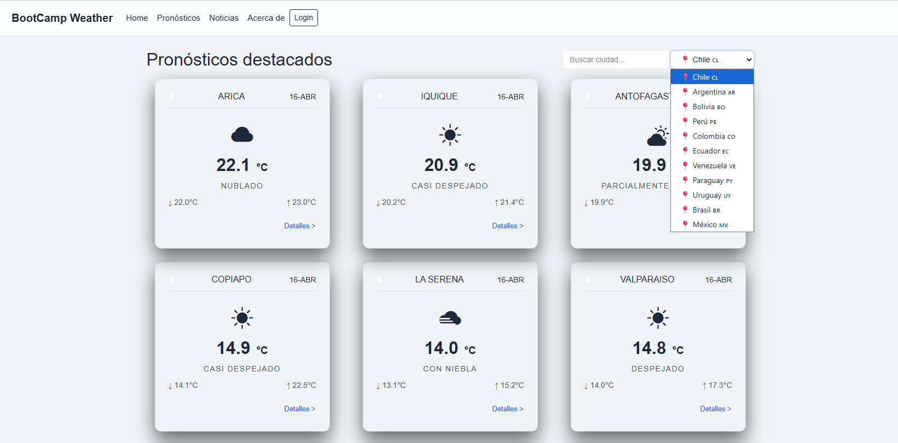
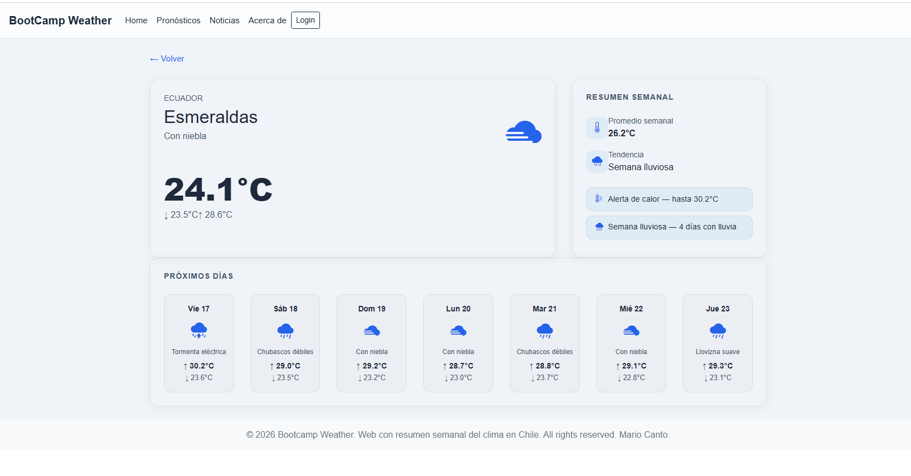
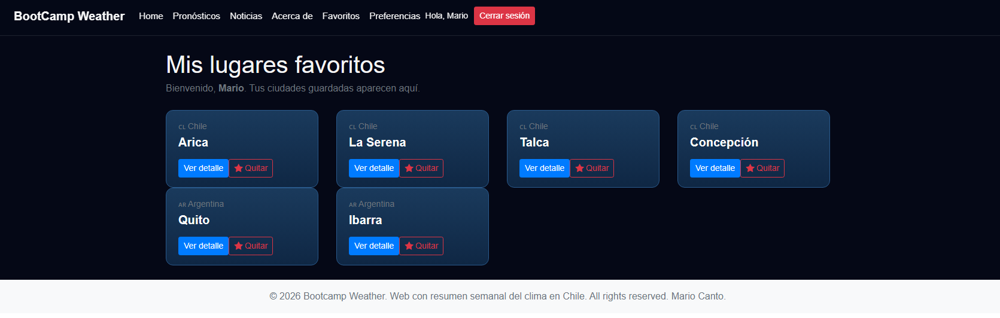

# 🌦️ WeatherFront – App de Clima (Portafolio final)

Aplicación SPA en Vue 3 que muestra el clima actual y el pronóstico de 7 días para distintas ciudades de Latinoamérica, con temas claro/oscuro, manejo de estado global con Vuex, favoritos, estadísticas semanales y alertas meteorológicas.

Este proyecto corresponde a la **entrega final de portafolio del Bootcamp Talento Digital (Sence)** y está pensado para ser mostrado en un portfolio profesional de FrontEnd.

---

## 🚀 Tecnologías principales

- **Vue 3** (Composition API)
- **Vue Router** (SPA con múltiples vistas)
- **Vuex** (manejo de estado global)
- **Vite** (tooling y dev server)
- **Axios** (consumo de APIs externas)
- **SASS/SCSS** (temas, variables y organización de estilos)
- **Bootstrap Icons** (iconografía del clima y UI)

---
---

## 📂 Estructura del proyecto

Vista simplificada de los directorios y archivos más relevantes:

```bash
BootCampWeather/
├─ App.vue
├─ main.js
│
├─ api/
│  ├─ http.js           # Cliente Axios base (config común)
│  ├─ newsApi.js        # Llamadas a NewsAPI (noticias LATAM)
│  └─ weatherApi.js     # Llamadas a Open-Meteo y helpers de clima
│
├─ assets/
│  ├─ css/
│  │  ├─ style.css      # CSS generado por SASS
│  │  └─ style.css.map
│  │
│  └─ scss/
│     ├─ main.scss      # Punto de entrada SASS
│     │
│     ├─ abstracts/
│     │  └─ _variables.scss     # Variables, mixins, tokens de color/tema
│     │
│     ├─ base/
│     │  └─ _reset.scss         # Reset / estilos base globales
│     │
│     ├─ components/
│     │  ├─ _buttonsFav.scss    # Botones de favorito (estrellas)
│     │  ├─ _favorite-card.scss # Tarjeta de favoritos
│     │  ├─ _news-card.scss     # Tarjetas de noticias
│     │  ├─ _searchInput.scss   # Inputs de búsqueda/select país
│     │  └─ _weather-card.scss  # Tarjetas de clima principales
│     │
│     ├─ layout/
│     │  └─ _header.scss        # Navbar / cabecera
│     │
│     ├─ pages/                 # (reservado para estilos específicos de vistas)
│     │
│     ├─ themes/
│     │  └─ _theme.scss         # Definición de temas light/dark (CSS variables)
│     │
│     └─ vendors/               # Espacio para estilos de terceros (si aplica)
│
├─ components/
│  ├─ Navbar.vue        # Barra de navegación principal (tema reactivo)
│  ├─ WeatherCard.vue   # Tarjeta de pronóstico destacado
│  └─ WelcomeItem.vue   # Componente de bienvenida / contenido informativo
│
├─ mock/
│  └─ users.js          # Usuarios mock para flujo de autenticación
│
├─ router/
│  └─ index.js          # Definición de rutas de la SPA
│
├─ store/
│  ├─ index.js          # Configuración principal de Vuex
│  └─ auth.js           # Módulo de autenticación, usuario, favoritos, prefs
│
├─ utils/
│  ├─ temperature.js    # Helpers de formato y unidades (°C/°F)
│  ├─ weatherConfig.js  # Países, ciudades, coordenadas, cache keys, locales
│  └─ weatherHelpers.js # Normalización de datos, códigos de clima, estadísticas
│
└─ views/
   ├─ AboutView.vue         # Información del proyecto / Quienes somos
   ├─ FavoritesView.vue     # Ciudades favoritas del usuario (requiere login)
   ├─ HomeView.vue          # Home / landing
   ├─ LoginView.vue         # Login (flujo de autenticación mock)
   ├─ LugarDetalleView.vue  # Detalle de ciudad + resumen semanal y alertas
   ├─ NewsView.vue          # Noticias relacionadas (NewsAPI)
   ├─ PreferencesView.vue   # Preferencias de unidad, tema, etc.
   ├─ PronosticosView.vue   # Pronósticos destacados por país/ciudad
   └─ RegisterView.vue      # Registro de usuario (mock / demo)
```
## ☁️ APIs utilizadas

### Open-Meteo

Se utiliza la API de **Open-Meteo** para obtener:

- Clima actual por ciudad (temperatura, código de clima, etc.).
- Pronóstico diario de 7 días (mínimas, máximas y códigos de clima).

Los datos crudos se normalizan en `weatherHelpers.js` mediante `normalizeLocations`, generando una estructura común para todos los países.

### NewsAPI (noticias relacionadas)

En la vista de noticias (`/news`) se consumen titulares en español de varios países de LATAM usando **NewsAPI**.  
La clave se configura mediante una variable de entorno:

```bash
VITE_NEWS_API_KEY=TU_API_KEY_AQUI
```

El consumo se hace con Axios, manejando estados de carga y errores básicos.

---

## 🧠 Lógica de clima, códigos y estadísticas

Toda la lógica de clima se centraliza en `src/utils/weatherHelpers.js`:

### Mapeo de códigos de clima

```js
export const WEATHER_CODES = {
  0:  { label: 'Despejado', emoji: '☀️' },
  1:  { label: 'Casi despejado', emoji: '🌤️' },
  2:  { label: 'Parcialmente nublado', emoji: '⛅' },
  3:  { label: 'Nublado', emoji: '☁️' },
  45: { label: 'Con niebla', emoji: '🌫️' },
  48: { label: 'Niebla helada', emoji: '🌫️' },
  51: { label: 'Llovizna suave', emoji: '🌦️' },
  53: { label: 'Llovizna', emoji: '🌦️' },
  55: { label: 'Llovizna fuerte', emoji: '🌧️' },
  61: { label: 'Lluvia débil', emoji: '🌧️' },
  63: { label: 'Lluvia', emoji: '🌧️' },
  65: { label: 'Lluvia fuerte', emoji: '🌧️' },
  71: { label: 'Nieve débil', emoji: '🌨️' },
  73: { label: 'Nieve', emoji: '❄️' },
  75: { label: 'Mucha nieve', emoji: '❄️' },
  77: { label: 'Granitos de nieve', emoji: '🌨️' },
  80: { label: 'Chubascos débiles', emoji: '🌦️' },
  81: { label: 'Chubascos', emoji: '🌧️' },
  82: { label: 'Chubascos fuertes', emoji: '⛈️' },
  85: { label: 'Chubascos débiles de nieve', emoji: '🌨️' },
  86: { label: 'Chubascos de nieve fuertes', emoji: '❄️' },
  95: { label: 'Tormenta eléctrica', emoji: '⛈️' },
  96: { label: 'Tormenta eléctrica con algo de granizo', emoji: '⛈️' },
  99: { label: 'Tormenta eléctrica con mucho granizo', emoji: '⛈️' },
}

export function getWeather(code) {
  return WEATHER_CODES[code] ?? { label: 'Desconocido', emoji: '🌡️' }
}
```

### Normalización de datos por país

```js
export function normalizeLocations(rawLocations, countryKey) {
  const cfg = COUNTRIES[countryKey]
  if (!cfg) return []

  return rawLocations.map((loc, i) => ({
    city: (cfg.cities ?? [])[i] ?? `Ubicación ${i + 1}`,
    temp: loc.current.temperature_2m,
    code: loc.current.weather_code,
    maxTemp: loc.daily.temperature_2m_max,
    minTemp: loc.daily.temperature_2m_min,
    forecast: loc.daily.time.map((date, j) => ({
      date,
      code: loc.daily.weather_code[j],
      maxTemp: loc.daily.temperature_2m_max[j],
      minTemp: loc.daily.temperature_2m_min[j],
    })),
  }))
}
```

### Estadísticas y alertas semanales

La función `getForecastStats(forecast)` calcula:

- Temperatura promedio semanal.
- Conteos de días calurosos, fríos y lluviosos.
- **Alertas**:
  - Ola de calor (máximas ≥ 25°C).
  - Ola de frío (mínimas ≤ 5°C).
  - Semana lluviosa (3+ días de lluvia).
- **Tipo de semana**: despejada, nublada, lluviosa o variada.

Estos datos se muestran en la vista de detalle (`/detalle/:country/:city`) en la sección “Resumen semanal”.

---

## 💾 Caché de clima en localStorage

Para evitar llamadas innecesarias a la API, se usa un caché simple en `localStorage` por país:

```js
export function saveWeatherData(countryKey, data) {
  const cfg = COUNTRIES[countryKey]
  if (!cfg) return
  const payload = { timestamp: Date.now(), data }
  localStorage.setItem(cfg.cacheKey, JSON.stringify(payload))
}
```

```js
export function loadWeatherData(countryKey) {
  const cfg = COUNTRIES[countryKey]
  if (!cfg) return null

  const raw = localStorage.getItem(cfg.cacheKey)
  if (!raw) return null

  try {
    const { timestamp, data } = JSON.parse(raw)
    const age = Date.now() - timestamp
    if (age > CACHE_TTL_MS) {
      localStorage.removeItem(cfg.cacheKey)
      return null
    }
    return data
  } catch (e) {
    localStorage.removeItem(cfg.cacheKey)
    return null
  }
}
```

El shape cacheado incluye ahora el campo `code` para cada ciudad, de modo que tanto la vista de tarjetas como la vista de detalle usan los mismos datos normalizados.

---

## 🎨 Temas visuales (light/dark)

La app soporta **modo claro y oscuro**, usando CSS variables y clases en el wrapper principal:

```css
.app-theme-dark {
  background-color: #050816;
  color: #f5f5f5;
  --card-text-primary: #ffffff;
  --card-text-secondary: rgba(255, 255, 255, 0.65);
  --card-link: #60a5fa;
  --card-border: rgba(255, 255, 255, 0.1);
  --nav-bg: rgba(5, 8, 22, 0.85);
  --nav-text: #f5f5f5;
  --nav-border: rgba(255, 255, 255, 0.1);
  --nav-btn-border: #ffffff;
  --nav-btn-text: #ffffff;
  --fav-star-empty: rgba(255,255,255, 0.3);
  --fav-star-full: #f1c40f;
}

.app-theme-light {
  background-color: #f0f4f8;
  color: #1a2a3a;
  --card-text-primary: #1e293b;
  --card-text-secondary: #475569;
  --card-link: #2563eb;
  --card-border: rgba(0, 0, 0, 0.08);
  --nav-bg: rgba(255, 255, 255, 0.8);
  --nav-text: #1a2a3a;
  --nav-border: rgba(0, 0, 0, 0.1);
  --nav-btn-border: #1a2a3a;
  --nav-btn-text: #1a2a3a;
  --fav-star-empty: #cbd5e1;
  --fav-star-full: #f59e0b;
}
```

Las tarjetas (`.weather-card`, `.home-card`) y vistas (`detail-card`, formularios, navbar) se adaptan automáticamente a estas variables. Se utiliza SASS para generar gradientes específicos para **día**, **tarde** y **noche** tanto en light como en dark mode.

### 🔴 Color coding del estado del clima (weather-dot)

Cada tarjeta de pronóstico incluye un pequeño indicador visual (`.weather-dot`) cuyo color cambia dinámicamente según el código de clima de la ciudad, usando el helper `getDotColor(code)`:

| Color | Estado |
|-------|--------|
| 🟡 Amarillo `#facc15` | Despejado / Casi despejado |
| 🟠 Naranja `#f97316` | Parcialmente nublado |
| ⚫ Gris `#6b7280` | Nublado / Niebla |
| 🔵 Azul `#3b82f6` | Lluvia / Chubascos / Llovizna |
| ⚪ Blanco `#e5e7eb` | Nieve |
| 🟣 Violeta `#a855f7` | Tormenta eléctrica |

El color se calcula una sola vez al normalizar los datos de la API y se pasa como prop a `WeatherCard.vue`, manteniéndose reactivo al tema sin necesidad de lógica adicional en el componente.
---

## 🔐 Autenticación, favoritos y preferencias

El proyecto incluye un módulo de autenticación simple con Vuex:

- Login ficticio (sin backend real), pensado como demo de flujo de login/logout.
- Rutas protegidas para secciones como **Favoritos**.
- Gestión de **favoritos**: el usuario puede marcar ciudades como favoritas desde las tarjetas, almacenando esa preferencia en el store.
- **Preferencias**:
  - Unidad de temperatura (°C/°F).
  - Tema visual (claro/oscuro).
  - Esas preferencias se leen desde el Vuex store en componentes como `LugarDetalleView` para mostrar correctamente las unidades y estilos.

---

## 🗺️ Rutas principales

| Ruta                           | Descripción                                                                 |
|--------------------------------|-----------------------------------------------------------------------------|
| `/`                            | Home (landing informativa)                                                 |
| `/pronosticos`                | Lista de pronósticos destacados (tarjetas por país/ciudad)                 |
| `/detalle/:country/:city`     | Detalle de un lugar: clima actual, próximos 7 días, estadísticas y alertas |
| `/news`                        | Noticias relacionadas (NewsAPI)                                            |
| `/login`                       | Vista de login                                                             |
| `/favoritos`                  | Ciudades favoritas del usuario (requiere login)                            |
| `/preferencias`               | Configuración de unidad, tema y otras preferencias                         |
| `/about`                      | Sección “Quienes somos” / información del proyecto                         |

---

## 🏃 Cómo correr el proyecto localmente

### Requisitos

- Node.js 18+ (recomendado)
- npm o pnpm

### Pasos

```bash
# 1. Clonar el repositorio
git clone https://github.com/Mackelf/BootCampWeather.git
cd BootCampWeather

# 2. Instalar dependencias
npm install

# 3. Configurar variables de entorno (NewsAPI)
echo "VITE_NEWS_API_KEY=TU_API_KEY_AQUI" > .env.local

# 4. Ejecutar en modo desarrollo
npm run dev
```

Luego abre la URL que Vite indique en consola (por defecto `http://localhost:5173`).

---

## 📸 Capturas


Vista principal con tarjetas de clima y selector de país.


Detalle de una ciudad mostrando clima actual, próximos 7 días y estadísticas/alertas.


Lista de ciudades favoritas con tema oscuro activado.



---

##  Demo Disponible en:
[BootCampWeather](https://mackelf.github.io/BootCampWeather/#/)

---
## 📌 Estado del proyecto

- ✅ SPA completa en Vue 3 con Vue Router.
- ✅ Consumo de API real de clima (Open-Meteo) con Axios.
- ✅ Manejo de estado global con Vuex (auth, preferencias, favoritos).
- ✅ Estadísticas y alertas meteorológicas basadas en datos reales.
- ✅ Temas claro/oscuro, estilos refinados con SASS y CSS variables.
- ✅ Caché de datos de clima por país con TTL básico en `localStorage`.
- ✅ Documentación lista para portafolio (este README).

---

## 📄 Licencia

Proyecto creado como parte del Bootcamp Talento Digital. Uso libre para fines de portafolio y aprendizaje.